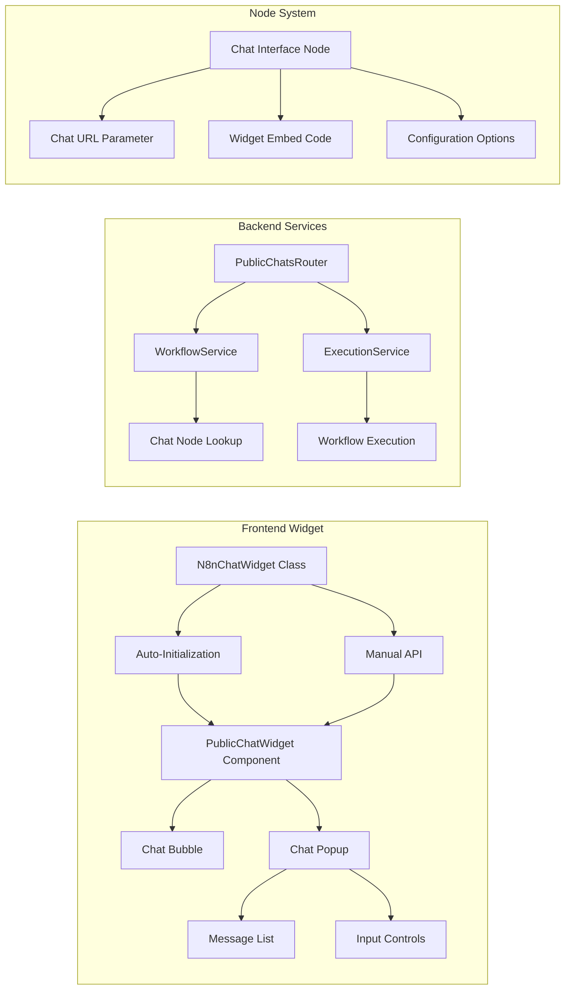

# Design Document

## Overview

The Public Chat Widget system enables users to embed interactive AI-powered chat interfaces on any website using a simple script tag. The design follows the established pattern of the existing public form widget, providing a floating chat bubble that expands into a full chat interface when clicked. The system integrates seamlessly with the existing workflow execution engine and Chat Interface nodes.

## Architecture

### High-Level Architecture

```mermaid
graph TB
    subgraph "Host Website"
        A[HTML Page] --> B[Chat Widget Script]
        B --> C[Chat Bubble UI]
        C --> D[Chat Popup Interface]
    end
    
    subgraph "Backend API"
        E[/api/public/chats/:chatId] --> F[Chat Configuration]
        G[/api/public/chats/:chatId/message] --> H[Message Processing]
        H --> I[Workflow Execution]
        I --> J[AI Response]
    end
    
    subgraph "Workflow System"
        K[Chat Interface Node] --> L[WebhookUrlGenerator]
        K --> M[WidgetEmbedGenerator]
        K --> N[Node Configuration]
    end
    
    D -.->|CORS Request| E
    D -.->|POST Message| G
    J -.->|Response| D
    
    L --> O[Unique Chat URL]
    M --> P[Embed Code]
    N --> Q[Chat Settings]
```

### Component Architecture



## Components and Interfaces

### 1. Chat Interface Node Extensions

#### New Node Parameters

```typescript
interface ChatNodeParameters {
  // Existing parameters
  acceptInput: boolean
  userMessage: string
  
  // New public widget parameters
  chatUrl: string              // Generated by WebhookUrlGenerator
  widgetEmbedCode: string      // Generated by WidgetEmbedGenerator
  chatTitle: string            // Widget title
  chatDescription: string      // Widget description
  placeholderText: string      // Input placeholder
  welcomeMessage: string       // Initial message
  widgetTheme: 'light' | 'dark' | 'auto'
  widgetPosition: 'bottom-right' | 'bottom-left' | 'top-right' | 'top-left'
  bubbleColor: string          // Chat bubble background color
  headerColor: string          // Chat header background color
}
```

#### Node Definition Updates

```javascript
// backend/src/nodes/Chat/ChatNode.ts - Additional properties
{
  displayName: "Chat URL",
  name: "chatUrl",
  type: "custom",
  required: false,
  default: "",
  description: "Generated public URL for accessing the chat widget",
  component: "WebhookUrlGenerator",
  componentProps: {
    mode: "production",
    urlType: "chat",
  },
},
{
  displayName: "Widget Embed Code",
  name: "widgetEmbedCode",
  type: "custom",
  required: false,
  default: "",
  description: "Get embed code to add this chat widget to any website",
  component: "WidgetEmbedGenerator",
  componentProps: {
    dependsOn: ["chatUrl"],
    widgetType: "chat"
  },
},
{
  displayName: "Chat Title",
  name: "chatTitle",
  type: "string",
  default: "AI Assistant",
  required: true,
  description: "Title displayed in the chat widget header",
},
{
  displayName: "Welcome Message",
  name: "welcomeMessage",
  type: "string",
  default: "Hello! How can I help you today?",
  description: "Initial message shown when chat opens",
},
{
  displayName: "Placeholder Text",
  name: "placeholderText",
  type: "string",
  default: "Type your message...",
  description: "Placeholder text for the message input field",
}
```

### 2. Backend API Routes

#### Chat Configuration Endpoint

```typescript
// GET /api/public/chats/:chatId
interface ChatConfigResponse {
  success: boolean
  chat?: {
    chatTitle: string
    chatDescription: string
    welcomeMessage: string
    placeholderText: string
    widgetTheme: string
    widgetPosition: string
    bubbleColor: string
    headerColor: string
    workflowName: string
    isActive: boolean
  }
  chatId: string
  workflowId: string
  error?: string
}
```

#### Message Processing Endpoint

```typescript
// POST /api/public/chats/:chatId/message
interface MessageRequest {
  message: string
  sessionId?: string
  workflowId: string
}

interface MessageResponse {
  success: boolean
  response?: string
  sessionId: string
  timestamp: string
  executionId?: string
  error?: string
}
```

### 3. Public Chat Widget Component

#### Widget Class Structure

```typescript
class N8nChatWidget {
  private container: HTMLElement
  private root: ReactRoot | null = null
  private config: ChatWidgetConfig
  
  constructor() {
    this.initializeAutoWidgets()
  }
  
  init(config: ChatWidgetConfig): void
  destroy(): void
  update(config: Partial<ChatWidgetConfig>): void
  
  private initializeAutoWidgets(): void
  private createChatInterface(config: ChatWidgetConfig): void
}

interface ChatWidgetConfig {
  chatId: string
  apiUrl?: string
  container?: string | HTMLElement
  theme?: 'light' | 'dark' | 'auto'
  position?: 'bottom-right' | 'bottom-left' | 'top-right' | 'top-left'
  onMessage?: (message: string) => void
  onResponse?: (response: string) => void
  onError?: (error: any) => void
}
```

#### React Component Structure

```typescript
interface PublicChatWidgetProps {
  chatId: string
  apiUrl?: string
  theme?: 'light' | 'dark' | 'auto'
  position?: string
  onMessage?: (message: string) => void
  onResponse?: (response: string) => void
  onError?: (error: any) => void
}

interface ChatMessage {
  id: string
  role: 'user' | 'assistant' | 'system'
  content: string
  timestamp: Date
}

interface ChatConfig {
  chatTitle: string
  chatDescription: string
  welcomeMessage: string
  placeholderText: string
  widgetTheme: string
  widgetPosition: string
  bubbleColor: string
  headerColor: string
}
```

### 4. Widget Embed Generator Component

#### Enhanced WidgetEmbedGenerator

```typescript
interface WidgetEmbedGeneratorProps {
  chatUrl?: string        // From dependsOn
  widgetType: 'form' | 'chat'
  disabled?: boolean
  value?: string
  onChange?: (value: string) => void
}

// Generate chat-specific embed codes
const autoInitCode = `<!-- Add this to your HTML -->
<div data-n8n-chat="${chatId}" 
     data-api-url="${apiUrl}"
     data-theme="light"
     data-position="bottom-right"></div>

<!-- Add the widget script -->
<script src="${widgetUrl}"></script>`

const manualInitCode = `<!-- Load widget script -->
<script src="${widgetUrl}"></script>

<!-- Initialize with JavaScript -->
<script>
  const widget = new window.N8nChatWidget();
  
  widget.init({
    chatId: '${chatId}',
    apiUrl: '${apiUrl}',
    theme: 'light',
    position: 'bottom-right',
    onMessage: (message) => {
      console.log('User sent:', message);
    },
    onResponse: (response) => {
      console.log('AI responded:', response);
    },
    onError: (error) => {
      console.error('Chat error:', error);
    }
  });
</script>`
```

## Data Models

### Chat Session Model

```typescript
interface ChatSession {
  sessionId: string
  chatId: string
  workflowId: string
  messages: ChatMessage[]
  createdAt: Date
  lastActivity: Date
  userAgent?: string
  ipAddress?: string
}
```

### Chat Configuration Model

```typescript
interface ChatConfiguration {
  chatId: string
  workflowId: string
  nodeId: string
  chatTitle: string
  chatDescription: string
  welcomeMessage: string
  placeholderText: string
  widgetTheme: 'light' | 'dark' | 'auto'
  widgetPosition: 'bottom-right' | 'bottom-left' | 'top-right' | 'top-left'
  bubbleColor: string
  headerColor: string
  isActive: boolean
  createdAt: Date
  updatedAt: Date
}
```

## Error Handling

### Frontend Error Handling

```typescript
enum ChatErrorType {
  NETWORK_ERROR = 'network_error',
  CHAT_NOT_FOUND = 'chat_not_found',
  WORKFLOW_INACTIVE = 'workflow_inactive',
  MESSAGE_TOO_LONG = 'message_too_long',
  RATE_LIMITED = 'rate_limited',
  EXECUTION_FAILED = 'execution_failed'
}

interface ChatError {
  type: ChatErrorType
  message: string
  details?: any
  timestamp: Date
}

// Error display in chat interface
const displayError = (error: ChatError) => {
  const errorMessage: ChatMessage = {
    id: `error-${Date.now()}`,
    role: 'system',
    content: `❌ ${error.message}`,
    timestamp: new Date()
  }
  addMessageToChat(errorMessage)
}
```

### Backend Error Responses

```typescript
// Standardized error responses
const errorResponses = {
  chatNotFound: {
    status: 404,
    body: {
      success: false,
      error: "Chat not found or is not active"
    }
  },
  workflowInactive: {
    status: 403,
    body: {
      success: false,
      error: "Chat workflow is not active"
    }
  },
  rateLimited: {
    status: 429,
    body: {
      success: false,
      error: "Too many messages from this IP, please try again later",
      retryAfter: 60
    }
  },
  executionFailed: {
    status: 500,
    body: {
      success: false,
      error: "Failed to process message",
      message: "The AI service is temporarily unavailable"
    }
  }
}
```

## Testing Strategy

### Unit Tests

1. **Widget Class Tests**
   - Initialization with different configurations
   - Auto-detection of data attributes
   - Manual API methods (init, destroy, update)
   - Error handling for invalid configurations

2. **React Component Tests**
   - Message rendering and styling
   - User input handling
   - API communication
   - Theme switching
   - Position changes

3. **Backend Route Tests**
   - Chat configuration retrieval
   - Message processing and workflow execution
   - Error handling for inactive workflows
   - Rate limiting functionality

### Integration Tests

1. **End-to-End Chat Flow**
   - Widget initialization on host page
   - Message sending and receiving
   - Workflow execution and response
   - Error scenarios (network failures, inactive workflows)

2. **Cross-Browser Compatibility**
   - Widget functionality across modern browsers
   - Mobile responsiveness
   - Theme detection and application

3. **Performance Tests**
   - Widget bundle size and load time
   - Message processing latency
   - Concurrent user handling

### Manual Testing Scenarios

1. **Embed Code Testing**
   - Copy embed code from node configuration
   - Test on different website types (WordPress, static HTML, React app)
   - Verify auto-initialization and manual initialization

2. **Configuration Testing**
   - Test different chat titles, colors, and positions
   - Verify theme switching (light/dark/auto)
   - Test welcome messages and placeholder text

3. **Workflow Integration Testing**
   - Test with different AI nodes (OpenAI, Anthropic)
   - Test with complex workflows (multiple nodes, conditions)
   - Test error handling when workflows fail

## Security Considerations

### CORS Configuration

```typescript
// Backend CORS setup for chat widgets
const corsOptions = {
  origin: (origin, callback) => {
    // Allow all origins for public widgets, but log for monitoring
    console.log('Chat widget request from:', origin)
    callback(null, true)
  },
  credentials: false, // No credentials needed for public chats
  methods: ['GET', 'POST'],
  allowedHeaders: ['Content-Type', 'Authorization']
}
```

### Rate Limiting

```typescript
// Chat-specific rate limiting
const chatRateLimits = {
  chatFetch: {
    windowMs: 60 * 1000,     // 1 minute
    max: 30,                 // 30 requests per minute
    message: "Too many chat configuration requests"
  },
  messageSubmit: {
    windowMs: 60 * 1000,     // 1 minute  
    max: 10,                 // 10 messages per minute
    message: "Too many messages, please slow down"
  }
}
```

### Input Validation

```typescript
// Message validation
const validateMessage = (message: string): ValidationResult => {
  if (!message || typeof message !== 'string') {
    return { valid: false, error: 'Message is required' }
  }
  
  if (message.length > 1000) {
    return { valid: false, error: 'Message too long (max 1000 characters)' }
  }
  
  if (message.trim().length === 0) {
    return { valid: false, error: 'Message cannot be empty' }
  }
  
  return { valid: true }
}
```

## Performance Optimizations

### Bundle Size Optimization

1. **Code Splitting**: Separate core widget from optional features
2. **Tree Shaking**: Remove unused UI components
3. **Compression**: Gzip compression for production builds
4. **CDN Delivery**: Host widget bundle on CDN for faster loading

### Runtime Performance

1. **Message Virtualization**: For long chat histories
2. **Debounced Input**: Prevent excessive API calls while typing
3. **Connection Pooling**: Reuse HTTP connections for multiple messages
4. **Caching**: Cache chat configuration to reduce API calls

### Build Configuration

```typescript
// vite.config.chat-widget.ts
export default defineConfig({
  plugins: [react()],
  build: {
    lib: {
      entry: resolve(__dirname, "src/widgets/chat/index.tsx"),
      name: "N8nChatWidget",
      fileName: (format) => `n8n-chat-widget.${format}.js`,
      formats: ["umd", "es"],
    },
    rollupOptions: {
      external: [], // Bundle everything for standalone widget
      output: {
        globals: {},
      },
    },
    outDir: "widgets/chat/dist",
    sourcemap: true,
    minify: 'terser', // Minify for production
  },
})
```

This design provides a comprehensive foundation for implementing the public chat widget system while maintaining consistency with the existing form widget architecture and ensuring scalability, security, and performance.