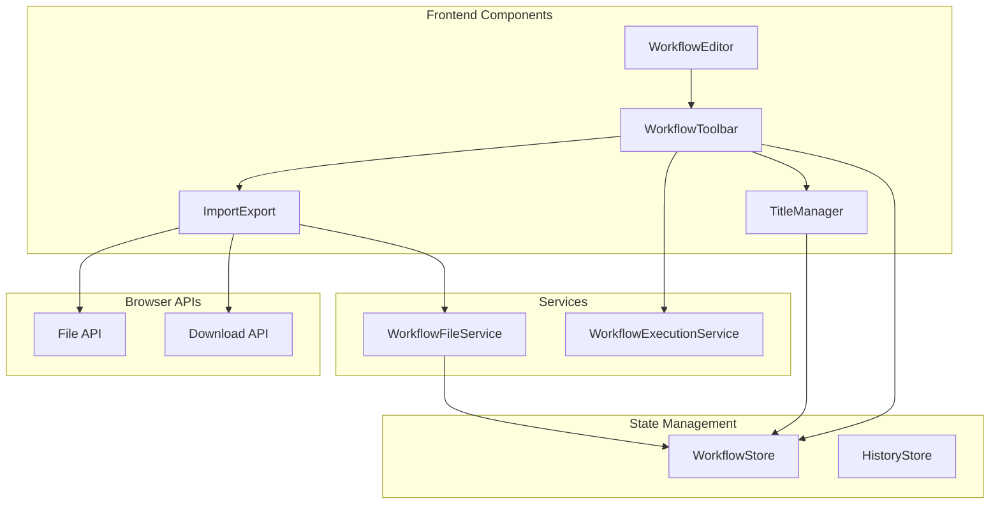
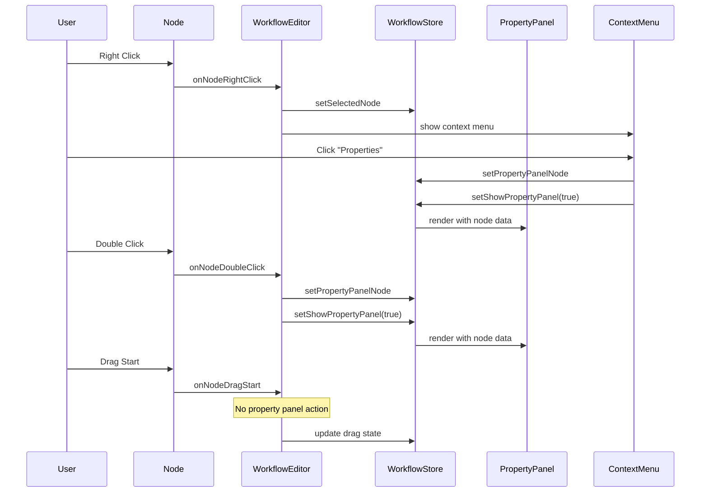

# Design Document

## Overview

This design addresses the workflow editor's top bar functionality gaps by implementing a comprehensive title management system, functional import/export capabilities, and robust execution controls. The solution builds upon the existing React-based workflow editor architecture, extending the WorkflowToolbar component and enhancing the workflow store to support these new features.

## Architecture

The enhancement follows the existing architecture pattern with clear separation of concerns:



## Components and Interfaces

### Enhanced WorkflowToolbar Component

The existing WorkflowToolbar will be enhanced with:

**New Props:**
```typescript
interface WorkflowToolbarProps {
  // Existing props...
  workflowTitle: string
  onTitleChange: (title: string) => void
  onExport: () => void
  onImport: (file: File) => void
  isExecuting: boolean
  executionProgress?: number
  executionStatus?: 'idle' | 'running' | 'success' | 'error'
}
```

**Title Management Section:**
- Inline editable title field with auto-save
- Visual indicators for unsaved title changes
- Keyboard shortcuts (Enter to save, Escape to cancel)

**Import/Export Section:**
- Export button with download functionality
- Import button with file picker integration
- Progress indicators during operations
- Error handling with user feedback

**Execution Section:**
- Enhanced execute button with status indicators
- Progress bar for long-running executions
- Stop functionality with confirmation
- Status badges (idle, running, success, error)

### TitleManager Component

A new dedicated component for title management:

```typescript
interface TitleManagerProps {
  title: string
  onChange: (title: string) => void
  onSave: (title: string) => void
  isDirty: boolean
  isEditing: boolean
  placeholder?: string
}
```

**Features:**
- Click-to-edit functionality
- Auto-save on blur or Enter key
- Visual feedback for dirty state
- Validation for title length and characters

### ImportExport Service

A new service to handle workflow file operations:

```typescript
interface WorkflowFileService {
  exportWorkflow(workflow: Workflow): Promise<void>
  importWorkflow(file: File): Promise<Workflow>
  validateWorkflowFile(file: File): Promise<boolean>
  generateFileName(workflow: Workflow): string
}
```

**Export Features:**
- JSON format with metadata
- Automatic filename generation
- Browser download integration
- Error handling for large workflows

**Import Features:**
- File validation before processing
- Schema validation for workflow structure
- Conflict resolution for existing workflows
- Progress feedback for large files

### Enhanced Workflow Store

Extensions to the existing workflow store:

```typescript
interface WorkflowStoreEnhancements {
  // Title management
  updateTitle: (title: string) => void
  titleDirty: boolean
  setTitleDirty: (dirty: boolean) => void
  
  // Import/Export
  exportWorkflow: () => Promise<void>
  importWorkflow: (file: File) => Promise<void>
  
  // Execution
  executeWorkflow: () => Promise<void>
  stopExecution: () => void
  executionState: ExecutionState
  setExecutionState: (state: ExecutionState) => void
  
  // Node interaction
  selectedNodeId: string | null
  setSelectedNode: (nodeId: string | null) => void
  showPropertyPanel: boolean
  setShowPropertyPanel: (show: boolean) => void
  propertyPanelNodeId: string | null
  setPropertyPanelNode: (nodeId: string | null) => void
}

interface ExecutionState {
  status: 'idle' | 'running' | 'success' | 'error'
  progress?: number
  startTime?: number
  endTime?: number
  error?: string
}
```

### Node Interaction Components

**Enhanced WorkflowEditor Component:**

The WorkflowEditor will be enhanced to handle new interaction patterns:

```typescript
interface NodeInteractionHandlers {
  onNodeClick: (nodeId: string, event: MouseEvent) => void
  onNodeDoubleClick: (nodeId: string, event: MouseEvent) => void
  onNodeRightClick: (nodeId: string, event: MouseEvent) => void
  onNodeDragStart: (nodeId: string, event: DragEvent) => void
  onNodeDrag: (nodeId: string, event: DragEvent) => void
  onNodeDragEnd: (nodeId: string, event: DragEvent) => void
}
```

**NodeContextMenu Component:**

A new component for right-click context menu:

```typescript
interface NodeContextMenuProps {
  nodeId: string
  position: { x: number; y: number }
  isVisible: boolean
  onClose: () => void
  onOpenProperties: (nodeId: string) => void
  onDuplicate?: (nodeId: string) => void
  onDelete?: (nodeId: string) => void
}
```

**PropertyPanel Component:**

Enhanced property panel with better state management:

```typescript
interface PropertyPanelProps {
  nodeId: string | null
  isVisible: boolean
  onClose: () => void
  position?: 'right' | 'bottom' | 'floating'
  node?: WorkflowNode
  onNodeUpdate: (nodeId: string, updates: Partial<WorkflowNode>) => void
}
```

## Data Models

### Enhanced Workflow Model

The existing Workflow interface will be extended to better support title management:

```typescript
interface WorkflowMetadata {
  title: string // Separate from name for display purposes
  lastTitleUpdate: string
  exportVersion: string
  importSource?: string
}

// Extended Workflow interface
interface Workflow {
  // Existing fields...
  metadata?: WorkflowMetadata
}
```

### Import/Export Format

Standardized format for workflow files:

```typescript
interface WorkflowExportFormat {
  version: string
  exportedAt: string
  exportedBy: string
  workflow: {
    title: string
    name: string
    description?: string
    nodes: WorkflowNode[]
    connections: WorkflowConnection[]
    settings: WorkflowSettings
    metadata?: WorkflowMetadata
  }
  checksum: string
}
```

## Error Handling

### Title Management Errors
- Invalid characters in title
- Title length validation
- Auto-save failures
- Concurrent edit conflicts

### Import/Export Errors
- File format validation
- Schema validation failures
- File size limitations
- Browser compatibility issues
- Network errors during save operations

### Execution Errors
- Workflow validation failures
- Node execution errors
- Connection timeouts
- Resource limitations
- Permission errors

### Node Interaction Errors
- Context menu positioning failures
- Property panel state synchronization issues
- Event handler conflicts during drag operations
- Node selection state inconsistencies

**Error Display Strategy:**
- Toast notifications for non-critical errors
- Modal dialogs for critical errors requiring user action
- Inline validation messages for form fields
- Status indicators in the toolbar for ongoing operations
- Context menu error states for failed actions

## Testing Strategy

### Unit Tests
- TitleManager component behavior
- ImportExport service functions
- Workflow store enhancements
- File validation logic
- Error handling scenarios

### Integration Tests
- Title save/load workflow
- Import/export round-trip testing
- Execution state management
- Error recovery scenarios
- Browser compatibility testing

### User Acceptance Tests
- Title editing user experience
- Import workflow from various sources
- Export workflow to different formats
- Execute workflow with progress feedback
- Error handling user experience
- Node interaction patterns (double-click, right-click, drag)
- Property panel opening and closing behavior
- Context menu functionality and positioning

### Test Data
- Sample workflow files for import testing
- Invalid workflow files for error testing
- Large workflows for performance testing
- Edge cases for validation testing

## Performance Considerations

### Title Management
- Debounced auto-save to prevent excessive API calls
- Local storage backup for unsaved titles
- Optimistic updates for better UX

### Import/Export
- Streaming for large workflow files
- Progress indicators for long operations
- File size validation before processing
- Memory management for large workflows

### Execution
- Non-blocking UI during execution
- Progress streaming from backend
- Cancellation support for long-running workflows
- Resource cleanup on completion or cancellation

## Security Considerations

### File Operations
- File type validation
- Content sanitization
- Size limitations
- Malicious file detection

### Title Management
- XSS prevention in title display
- Input sanitization
- Length limitations
- Special character handling

### Execution
- Workflow validation before execution
- Permission checks
- Resource limitations
- Audit logging

### Node Interactions
- Event handler security to prevent XSS
- Context menu action validation
- Property panel data sanitization
- Drag operation boundary validation

## Node Interaction Design Details

### Event Handling Strategy

The node interaction system will use a layered event handling approach:

1. **Drag Operations**: Separate drag handlers that don't trigger property panel
2. **Click Detection**: Distinguish between single clicks, double clicks, and right clicks
3. **Context Menu**: Position-aware context menu with proper cleanup
4. **Property Panel**: State-managed panel with clear ownership of which node is being edited

### Interaction Flow



### Context Menu Design

The context menu will be positioned intelligently to avoid screen edges and provide relevant actions:

- **Properties**: Opens the property panel for the node
- **Duplicate**: Creates a copy of the node (if supported)
- **Delete**: Removes the node with confirmation
- **Separator lines** between action groups
- **Keyboard navigation** support
- **Click-outside-to-close** behavior