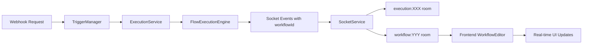

# Webhook Socket Messages Fix

## Problem
Webhook executions were not visible in the frontend when a user had a workflow open. The executions completed successfully but no socket messages were received, so the user couldn't see:
- Execution started notifications
- Node execution progress
- Execution completed status
- Real-time updates

## Root Cause
The socket broadcast system had a fundamental flaw in how it handled webhook-triggered executions:

1. **Frontend Subscription Issue**: When a user opened a workflow, the frontend never subscribed to workflow-level socket events
2. **Backend Broadcasting Issue**: The backend only broadcast socket events to execution-specific rooms (`execution:${executionId}`)
3. **Timing Problem**: Webhook executions create NEW execution IDs that the frontend doesn't know about in advance

### The Flow Problem:
```
1. User opens workflow (no executionId yet, so no subscription)
2. Webhook triggers → creates NEW executionId
3. Backend broadcasts to execution:${newExecutionId} room
4. Frontend is NOT in that room → no messages received ❌
```

## Solution

### 1. Frontend: Subscribe to Workflow Room
Added workflow subscription in `WorkflowEditorPage.tsx`:

```typescript
// Subscribe to workflow socket events for real-time webhook execution updates
useEffect(() => {
  if (!id || id === 'new') return

  console.log('[WorkflowEditor] Subscribing to workflow:', id)
  
  // Subscribe to workflow updates
  socketService.subscribeToWorkflow(id)

  // Cleanup: unsubscribe when component unmounts or workflow changes
  return () => {
    console.log('[WorkflowEditor] Unsubscribing from workflow:', id)
    socketService.unsubscribeFromWorkflow(id)
  }
}, [id])
```

### 2. Backend: Broadcast to Both Rooms
Updated `SocketService.broadcastExecutionEvent()` to broadcast to BOTH:
- `execution:${executionId}` - for clients subscribed to specific execution
- `workflow:${workflowId}` - for clients viewing the workflow

```typescript
public broadcastExecutionEvent(
  executionId: string,
  eventData: ExecutionEventData,
  workflowId?: string // Optional workflow ID to also broadcast to workflow room
): void {
  // ... existing code ...

  // Emit to execution-specific room
  this.io
    .to(`execution:${executionId}`)
    .emit("execution-event", eventWithTimestamp);

  // ALSO emit to workflow room if workflowId provided
  if (workflowId) {
    logger.debug(
      `Also broadcasting execution event to workflow room: workflow:${workflowId}`
    );
    this.io
      .to(`workflow:${workflowId}`)
      .emit("execution-event", eventWithTimestamp);
  }
}
```

### 3. Flow Events: Include workflowId
Updated `FlowExecutionEngine` to include `workflowId` in all events:

**FlowExecutionResult interface:**
```typescript
export interface FlowExecutionResult {
  executionId: string;
  workflowId: string; // Added to support workflow-level socket broadcasts
  status: "completed" | "failed" | "cancelled" | "partial";
  executedNodes: string[];
  failedNodes: string[];
  executionPath: string[];
  totalDuration: number;
  nodeResults: Map<string, NodeExecutionResult>;
}
```

**Event emissions:**
```typescript
this.emit("nodeExecuted", {
  executionId: context.executionId,
  workflowId: context.workflowId, // Include workflowId for socket broadcasts
  nodeId,
  status: result.status,
  result,
});
```

### 4. ExecutionService: Pass workflowId to Socket Broadcasts
Updated all socket broadcasts in ExecutionService to pass workflowId:

```typescript
// Flow execution completed event
global.socketService.broadcastExecutionEvent(
  flowResult.executionId,
  {
    executionId: flowResult.executionId,
    type: "completed",
    timestamp: new Date(),
    data: { /* ... */ },
  },
  flowResult.workflowId // Pass workflowId to broadcast to workflow room
);

// Node execution events
global.socketService.broadcastExecutionEvent(
  nodeEventData.executionId,
  {
    executionId: nodeEventData.executionId,
    type: eventType,
    nodeId: nodeEventData.nodeId,
    /* ... */
  },
  nodeEventData.workflowId // Pass workflowId to broadcast to workflow room
);
```

## Impact

### Before Fix:
- ❌ Webhook executions invisible in frontend
- ❌ No real-time updates for webhook triggers
- ❌ Had to refresh page to see execution results
- ❌ User confusion: "Did the webhook work?"

### After Fix:
- ✅ Real-time webhook execution notifications
- ✅ Live node execution progress
- ✅ Execution status updates
- ✅ Consistent experience with manual executions

## Architecture

### Socket Room Strategy:
```
execution:${executionId}   → For specific execution subscribers
                             (Execution detail page, execution monitoring)

workflow:${workflowId}      → For workflow viewers
                             (Workflow editor, anyone viewing the workflow)

user:${userId}              → For user-specific broadcasts
                             (Not used for executions currently)
```

### Event Flow:


## Testing

### Manual Test:
1. Open a workflow with a webhook trigger in the browser
2. Check browser console for: `[WorkflowEditor] Subscribing to workflow: {workflowId}`
3. Send HTTP request to webhook URL
4. Verify socket messages appear in browser console:
   - `Socket.io execution-event` messages
   - Node execution events
   - Execution completed event
5. Verify UI updates in real-time

### Console Logs to Check:
```
Backend:
- "Broadcasting execution event for {executionId}: completed"
- "Also broadcasting execution event to workflow room: workflow:{workflowId}"

Frontend:
- "[WorkflowEditor] Subscribing to workflow: {workflowId}"
- "Socket.io execution-event" (multiple messages)
```

## Files Changed

### Frontend:
- `frontend/src/pages/WorkflowEditorPage.tsx`
  - Added import for socketService
  - Added useEffect to subscribe/unsubscribe to workflow

### Backend:
- `backend/src/services/SocketService.ts`
  - Updated `broadcastExecutionEvent()` signature to accept optional `workflowId`
  - Added workflow room broadcast logic

- `backend/src/services/FlowExecutionEngine.ts`
  - Added `workflowId` to `FlowExecutionResult` interface
  - Updated all `this.emit()` calls to include `workflowId`

- `backend/src/services/ExecutionService.ts`
  - Updated event handlers to pass `workflowId` to socket broadcasts
  - Added `workflowId` to console logs for debugging

## Related Documentation
- [Webhook Flow Diagram](./docs/WEBHOOK_FLOW_DIAGRAM.md)
- [Webhook Execution Service Refactor](./WEBHOOK_EXECUTION_SERVICE_REFACTOR.md)
- [Webhook URL Generator Implementation](./WEBHOOK_URL_GENERATOR_IMPLEMENTATION.md)

## Future Enhancements
1. **Progress Tracking**: Add granular progress updates for long-running webhook executions
2. **Execution Notifications**: Show toast notifications when webhook executions complete
3. **Execution History Live Updates**: Update execution history list in real-time when webhooks trigger
4. **Multi-Tab Sync**: Ensure all open tabs showing the same workflow receive updates

---

**Last Updated**: October 10, 2025  
**Issue**: Webhook executions not visible in frontend  
**Status**: ✅ Fixed
